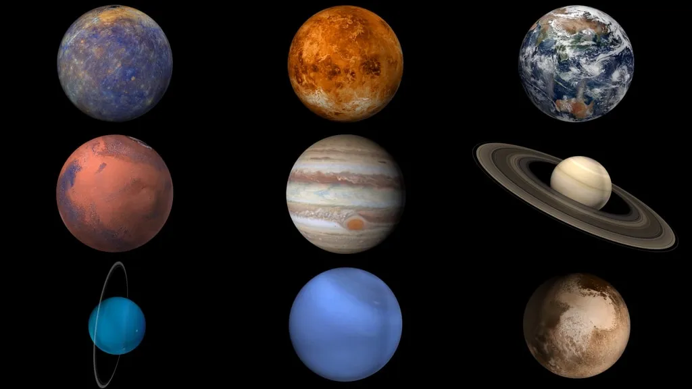

# Planets and Influence 🌌  

Understand the planets and their energies, from planets like the Sun and Moon to outer planets like Uranus and Saturn. Each planet adds its own layer of meaning to a natal chart, shaping how signs and houses are expressed.  

---

# Planetary Influence Resources  

### Visual
  

*A quick look at the planets in our solar system and their symbolic role in astrology.*  

### Reference PDF
![[../assets/astrology-planet-meanings.pdf]]  

*A PDF guide that explains the key meanings and traits of each planet.*  

---

# Planets Quick Reference  

| Planet  | Symbol | Core Meaning                | Keywords                        |
| ------- | ------ | --------------------------- | ------------------------------- |
| Sun     | ☉      | Identity, vitality, ego     | Self, purpose, life force       |
| Moon    | ☽      | Emotions, inner world       | Feelings, intuition, habits     |
| Mercury | ☿      | Communication, intellect    | Mind, language, logic           |
| Venus   | ♀      | Love, beauty, values        | Relationships, harmony, art     |
| Mars    | ♂      | Action, willpower, drive    | Passion, conflict, energy       |
| Jupiter | ♃      | Expansion, growth, wisdom   | Luck, philosophy, abundance     |
| Saturn  | ♄      | Discipline, structure, time | Responsibility, limits, karma   |
| Uranus  | ♅      | Innovation, rebellion       | Change, freedom, originality    |
| Neptune | ♆      | Dreams, spirituality        | Illusion, mysticism, compassion |
| Pluto   | ♇      | Transformation, power       | Rebirth, depth, control         |

## Related Categories  
Planetary influence connects directly with:  
- [[zodiac-signs/index|Zodiac Signs]] (how planets express themselves in signs)  
- [[houses-and-aspects/index|Houses]] (the life areas where planetary energy plays out)  
- [[elements-and-modalities/index|Elements & Modalities]] (how planets emphasize traits across the zodiac)  
